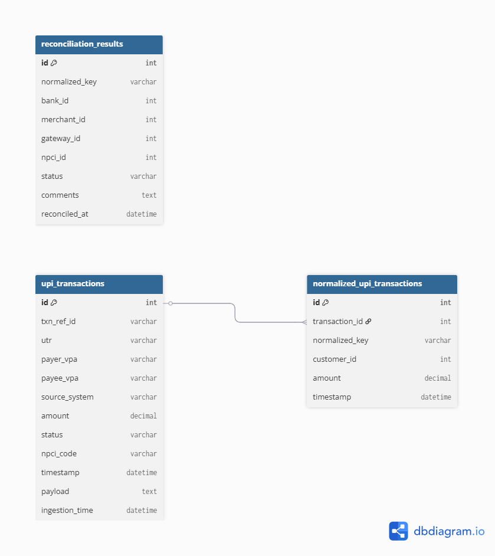

# UPI Payment Reconciliation System

A microservices-based system to reconcile UPI transactions across multiple sources (Bank, NPCI, Merchant, PSP).

---

## 🔧 Tech Stack
- Java 17 + Spring Boot
- PostgreSQL
- Kafka
- gRPC / REST APIs
- Docker & Docker Compose
- Distributed Cron (Quartz / ShedLock)

---

## 📌 Modules

| Service               | Responsibility                                  |
|------------------------|-------------------------------------------------|
| Ingest Service         | Collects raw UPI logs from different systems    |
| Normalizer Service     | Converts raw txns into a unified format         |
| Reconciliation Service | Matches transactions using business rules      |
| Scheduler Service      | Triggers batch reconciliation                   |
| Report Service         | Serves reconciliation status via REST API       |
| Notification Service   | Sends alerts for failures, mismatches           |

---

## 🗄️ Database Design



Tables:
- `upi_transactions`
- `normalized_upi_transactions`
- `reconciliation_results`

---

## 🚀 Getting Started

```bash
git clone https://github.com/Afif-Shaikh/UPI-Payment-Reconciliation-System.git
cd upi-reconciliation-system
docker-compose up
